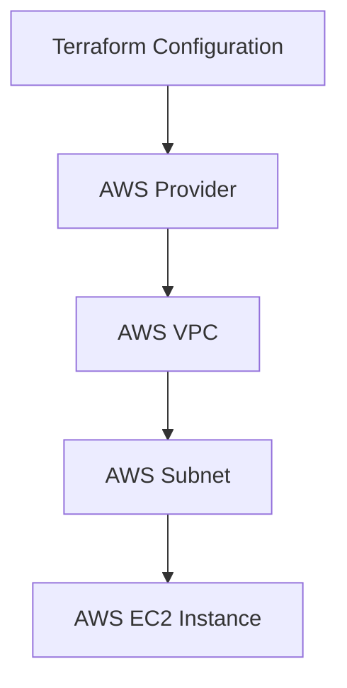
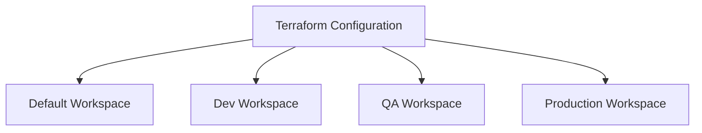
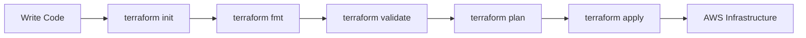

# 🚀 AWS Infrastructure Creation with Terraform

A beginner-friendly Infrastructure as Code (IaC) project that provisions AWS infrastructure using Terraform.

This project creates an AWS VPC, Subnet, and EC2 Instance while demonstrating Terraform Variables, Outputs, and Workspaces.

---

## 📌 Project Overview

Infrastructure is traditionally created manually through the AWS Management Console.

With Terraform, infrastructure can be defined as code and managed using a repeatable workflow.

This project demonstrates the following AWS infrastructure:

- 🌐 AWS VPC
- 🔗 AWS Subnet
- 🖥️ AWS EC2 Instance

It also demonstrates:

- Infrastructure as Code (IaC)
- Terraform Providers
- Terraform Resources
- Terraform Variables
- Terraform Outputs
- Terraform Workspaces
- Git and GitHub

---

# 🏗️ Architecture



### Infrastructure Flow

```text
Terraform
    │
    ▼
AWS Provider
    │
    ▼
VPC
    │
    ▼
Subnet
    │
    ▼
EC2 Instance
```

---

# 🌍 Terraform Workspaces

Terraform Workspaces allow the same Terraform configuration to manage multiple environments.



The active workspace can be accessed using:

```hcl
terraform.workspace
```

The workspace name is used in resource tags.

For example:

```text
terraform-vpc-default
terraform-vpc-dev
terraform-vpc-qa
terraform-vpc-prod
```

---

# 🛠️ Technologies Used

| Technology | Purpose |
|---|---|
| Terraform | Infrastructure as Code |
| AWS | Cloud Platform |
| Amazon VPC | Network Isolation |
| Amazon EC2 | Virtual Server |
| Git | Version Control |
| GitHub | Code Repository |

---

# 📁 Project Structure

```text
AWS-instance-creation-with-terraform/
│
├── main.tf
├── variables.tf
├── output.tf
├── .gitignore
├── .terraform.lock.hcl
└── README.md
```

## File Description

| File | Description |
|---|---|
| `main.tf` | Defines the AWS infrastructure resources |
| `variables.tf` | Defines Terraform input variables |
| `output.tf` | Defines Terraform outputs |
| `.gitignore` | Prevents unnecessary and sensitive files from being committed |
| `.terraform.lock.hcl` | Locks Terraform provider versions |
| `README.md` | Project documentation |

---

# ⚙️ Prerequisites

Before running this project, make sure you have:

- Terraform installed
- AWS CLI installed
- AWS credentials configured
- Git installed
- An AWS account

---

## Verify Terraform

```bash
terraform --version
```

## Verify AWS CLI

```bash
aws --version
```

## Configure AWS Credentials

```bash
aws configure
```

---

# 🚀 Getting Started

## 1️⃣ Clone the Repository

```bash
git clone git@github.com:OnyxParadox/AWS-instance-creation-with-terraform.git
```

Move into the project directory:

```bash
cd AWS-instance-creation-with-terraform
```

---

## 2️⃣ Initialize Terraform

```bash
terraform init
```

This command:

- Downloads the required Terraform provider
- Initializes the Terraform working directory
- Creates the `.terraform` directory

---

## 3️⃣ Format the Configuration

```bash
terraform fmt
```

This formats Terraform configuration files according to standard conventions.

---

## 4️⃣ Validate the Configuration

```bash
terraform validate
```

This checks whether the Terraform configuration is valid.

---

## 5️⃣ Review the Execution Plan

```bash
terraform plan
```

Terraform displays the resources that will be created.

---

## 6️⃣ Create the Infrastructure

```bash
terraform apply
```

Type:

```text
yes
```

when prompted.

Terraform will create:

```text
AWS VPC
   │
   └── AWS Subnet
           │
           └── AWS EC2 Instance
```

---

# 📤 Terraform Outputs

After infrastructure creation, Terraform displays useful information.

The project outputs:

- VPC ID
- Subnet ID
- EC2 Instance ID
- Current Terraform Workspace

View outputs using:

```bash
terraform output
```

---

# 🌍 Working with Terraform Workspaces

## View Available Workspaces

```bash
terraform workspace list
```

---

## Create a Development Workspace

```bash
terraform workspace new dev
```

---

## Create a QA Workspace

```bash
terraform workspace new qa
```

---

## Create a Production Workspace

```bash
terraform workspace new prod
```

---

## Switch Between Workspaces

```bash
terraform workspace select dev
```

---

## Check the Current Workspace

```bash
terraform workspace show
```

---

# 🔄 Terraform Workflow

A typical Terraform workflow is:



---

# 🧹 Destroy Infrastructure

To avoid unnecessary AWS charges, destroy the resources when they are no longer required.

```bash
terraform destroy
```

Type:

```text
yes
```

when prompted.

> ⚠️ Terraform destroys resources associated with the currently selected workspace.

If you create infrastructure in multiple workspaces, make sure you destroy resources in each workspace.

Example:

```bash
terraform workspace select dev
terraform destroy

terraform workspace select default
terraform destroy
```

---

# 🔒 Terraform State Security

Terraform uses state files to track infrastructure.

Examples include:

```text
terraform.tfstate
terraform.tfstate.backup
terraform.tfstate.d/
```

These files are excluded using `.gitignore`.

Terraform state files should generally not be committed to public repositories because they can contain infrastructure metadata and potentially sensitive information.

For production environments, a remote backend should be used.

Possible future setup:

```text
Terraform
    │
    ▼
Remote Backend
    │
    ├── AWS S3
    │
    └── State Locking
```

---

# 📚 What I Learned

Through this project, I learned:

- Infrastructure as Code (IaC)
- Terraform configuration basics
- Terraform Providers
- Terraform Resources
- Terraform Variables
- Terraform Outputs
- Terraform State
- Terraform Workspaces
- AWS VPC
- AWS Subnets
- AWS EC2
- Infrastructure dependencies
- Git version control
- GitHub repositories
- SSH authentication with GitHub
- `.gitignore` best practices

---

# 🔮 Future Improvements

Future improvements for this project include:

- [ ] Create Public and Private Subnets
- [ ] Add an Internet Gateway
- [ ] Configure Route Tables
- [ ] Add Security Groups
- [ ] Add multiple Availability Zones
- [ ] Use Terraform Modules
- [ ] Configure an AWS S3 Remote Backend
- [ ] Add State Locking
- [ ] Create environment-specific configurations
- [ ] Add CI/CD using GitHub Actions or Jenkins

---

# 👨‍💻 Author

**Srujan Shirkar**

Aspiring DevOps Engineer

Learning and building practical projects in:

```text
Linux
   ↓
Networking
   ↓
Git & GitHub
   ↓
AWS
   ↓
Terraform
   ↓
Docker
   ↓
Jenkins
   ↓
Kubernetes
   ↓
CI/CD
```

---

# ⭐ Learning Journey

This repository is part of my DevOps learning journey.

My goal is to learn DevOps concepts by building practical projects and understanding how tools are used in real-world infrastructure environments.

> 🚀 Learning by Building. Improving by Practicing.